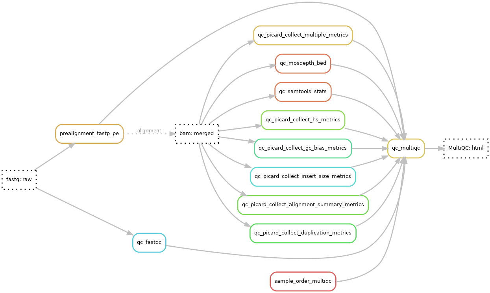

# Steps in Marple :woman_detective:
To go into details of the pipeline we dived the pipeline into modules similar to Hydra-Genetics module system.

---
## Prealignment
See the **Prealignment** hydra-genetics module documentation on [ReadTheDoc](https://hydra-genetics-prealignment.readthedocs.io/en/latest/) or [github](https://github.com/hydra-genetics/prealignment) documentation for more details on the softwares. Default hydra-genetics settings/resources are used if no configuration is specified.

{: style="height:30%;width:30%"}

### Pipeline output files
Only temporary intermediate files are created.

### Trimming
Trimming of fastq files is performed by **[fastp](https://github.com/OpenGene/fastp)** v0.20.1.  

### Merging
Merging of fastq files belonging to the same sample are performed by simply concatenating the files with **cat** if applicable.

---
## Alignment
See **Alignment** hydra-genetics module on [ReadTheDocs](https://hydra-genetics-alignment.readthedocs.io/en/latest/) or [github](https://github.com/hydra-genetics/alignment/tree/v0.4.0) for more information and documentation on the softwares used in the alignment steps. 

{: style="height:100%;width:100%"}

### Pipeline output files:

* `Results/{sample}_{sequenceid}/{sample}_{sequenceid}.bam`
* `Results/{sample}_{sequenceid}/{sample}_{sequenceid}.bam.bai`

### Alignment with BWA-mem
Alignment of fastq files into bam files is performed by **[bwa-mem](https://github.com/lh3/bwa)** v0.7.17 using the trimmed fastq files. This make it possible to speed up alignment by utilizing parallelization and also make it possible to analyze qc for lanes separately. Bamfiles are then directly sorted by **[samtools sort](http://www.htslib.org/doc/samtools-sort.html)** v1.15.

#### Read groups
Bam file read groups are set according to sequencing information in the `units.tsv` file.
The @RG read tag is set using the following options defined in the hydra-genetics bwa rule:
```
-R '@RG\tID:{ID}\tSM:{SM}\tPL:{PL}\tPU:{PU}\tLB:{LB}' -v 1
```
where the individual read groups are defined below:

| **RG tag** | **Value** |
|-------------|-|
| ID | sample_type.lane.barcode |
| SM | sample_type |
| PL | platform |
| PU | flowcell.lane.barcode |
| LB | sample_type |

### Bam splitting
The bam files are split into chromosome files for faster performance in downstream analysis. Split files are used by markduplicates. Splitting is performed by **[samtools view](http://www.htslib.org/doc/samtools-view.html)** v1.15.

### Mark duplicates
Flagging duplicated reads are performed on individual chromosome bam files by **[picard MarkDuplicates](https://broadinstitute.github.io/picard/command-line-overview.html#MarkDuplicates)** v2.25.4.

### Merging
Merging of deduplicated bam files belonging to the same sample are performed by **[samtools merge](http://www.htslib.org/doc/samtools-merge.html)** v1.15.

### Sorting
Merged bamfile are sorted by **[samtools sort](http://www.htslib.org/doc/samtools-sort.html)** v1.15.

### Bam indexing
Bamfile indexing is performed by **[samtools index](http://www.htslib.org/doc/samtools-index.html)** v1.15.

---
## SNV indels
SNV and indels are called using the **Parabricks** ([github](https://github.com/hydra-genetics/parabricks/tree/v1.1.0)) and **SNV_indels** ([ReadTheDoc](https://hydra-genetics-snv-indels.readthedocs.io/en/latest/) or [github](https://github.com/hydra-genetics/snv_indels/tree/v0.5.0)) modules. Annotation is then done with **Annotation** module ([ReadTheDocs](https://hydra-genetics-annotation.readthedocs.io/en/latest/) or [github](https://github.com/hydra-genetics/annotation/tree/v0.3.0)).

{: style="height:100%;width:100%"}

!!! warning
    As of now a GPU with licensed Parabricks is needed ro run SNV calling. A non-licensed CPU alternative will be added at a later stage.

### Pipeline output files

* `Results/{sample}_{sequenceid}/{sample}_{sequenceid}.vcf.gz`
* `Results/{sample}_{sequenceid}/{sample}_{sequenceid}.genome.vcf.gz`

### SNV calling
#### GPU track
Variants are called using [**Parabricks deepvariant** v4.1.1-1](https://docs.nvidia.com/clara/parabricks/latest/documentation/tooldocs/man_deepvariant.html#man-deepvariant) on a GPU licensed for Parabricks. `pbrun_deepvariant` is run with the interval file `config["refernce"]["design_bed"]` and the extra parameters defined in `config.yaml` (`--use-wes-model --disable-use-window-selector-model --gvcf `). This ensures that a genome vcf is produced as well as a standard vcf, by using `disable-use-window-selector-model` we increases reproducibility for later implementation of a parallel CPU-track. The AF field is added to the `INFO` column in the vcf:s using the `fix_af.py` from the snv_indel module. The vcf header in the standard vcf is also updated to include a reference line using the `add_ref_to_vcf.py` to ensure that programs such as Alissa acknowledge the use of Hg38.

#### CPU track
!!! note
    To be added.

### Normalizing
The standard vcf files is decomposed with [**vt decompose**](https://genome.sph.umich.edu/wiki/Vt#Decompose) followed by [**vt decompose_blocksub**](https://genome.sph.umich.edu/wiki/Vt#Decompose_biallelic_block_substitutions) v2015.11.10. The decomposed vcf files are then normalized by [**vt normalize**](https://genome.sph.umich.edu/wiki/Vt#Normalization) v2015.11.10.

### Annotation
Both the normalized standard VCF files and the genome vcf files are then annotated using **[VEP](https://www.ensembl.org/info/docs/tools/vep/index.html)** v109.3. Vep is run with the extra parameters `--assembly GRCh38 --check_existing --pick --variant_class --everything`.

See the [annotation hydra-genetics module](https://hydra-genetics-annotation.readthedocs.io/en/latest/) for additional information.

---
## CNV
CNVs are called using the Hydra-Genetics **CNV_SV** module ([ReadTheDocs](https://hydra-genetics-cnv-sv.readthedocs.io/en/latest/) or [github](https://github.com/hydra-genetics/cnv_sv/tree/78f270c)).
<br />

{: style="height:60%;width:60%"}

### Pipeline output files

* `Results/{sample}_{sequenceid}/{sample}_{sequenceid}_exomedepth_SV.txt`
* `Results/{sample}_{sequenceid}/{sample}_{sequenceid}_exomedepth.aed`

### Exomedepth
To call larger structural variants **[Exomedepth](https://cran.r-project.org/web/packages/ExomeDepth/index.html)** v1.1.15 is used. Exomedepth does **not** use a window approach but evaluates each row in the bedfile as a segment, therefor the bedfile need to be split into appropriate large windows (e.g. using `bedtools makewindows`). Exomedepth also need a `RData` file containing the normal pool, this can be created using the [Marple - references workflow](/running_ref). Lines with no-change calls (`reads.ratio == 1`) are removed from the output for Alissa compatibility. 

---
## QC
For quality control the **QC** module ([ReadTheDocs](https://hydra-genetics-qc.readthedocs.io/en/latest/) or [github](https://github.com/hydra-genetics/qc/tree/ca947b1)) is used and the results are summarized/aggregated into a MultiQC-report.

<br />

{: style="height:70%;width:70%"}

### Pipeline output files
* `Results/{sequenceid}_MultiQC.html`

### MultiQC
A MultiQC html report is generated using **[MultiQC](https://github.com/ewels/MultiQC)** v1.11. The report starts with a general statistics table showing the most important QC-values followed by additional QC data and diagrams. See [result files page](/result_files) for more in-depth info on general stats columns. The qc data is collected and generated using Fastp, FastQC, samtools, picard and Mosdepth.

The samples in the MultiQC report is renamed and ordered based on the order of the `SampleSheet.csv` to enable easier integration with the wet lab follow-up.


The report is configured based on a MultiQC config file. 

/// details | Expand to view current MultiQC config.yaml
```yaml

```
///


### FastQC
**[FastQC](https://www.bioinformatics.babraham.ac.uk/projects/fastqc/)** v0.11.9 is run on the raw fastq-files before trimming.

### Mosdepth
**[Mosdepth](https://github.com/brentp/mosdepth)** v0.3.2 is used together with a bedfile covering all coding exons (`config[reference][exon_bed]`) and thresholds (`10,20,50`) to calculate coverage.

### Samtools
**[Samtools stats](http://www.htslib.org/doc/samtools-stats.html)** v1.15 is run on BWA-mem aligned and merged bam files without any designfile.

### Picard
**[Picard](https://broadinstitute.github.io/picard/)** v2.25.4 is run on BWA-mem aligned and merged bam files collecting a number of metrics. The metrics calculated are listed below:

* **picard CollectAlignmentSummaryMetrics** - using fasta reference genome file
* **picard CollectDuplicationMetrics**
* **picard CollectGCBiasMetrics**
* **picard CollectHsMetrics** - using fasta reference genome file, the full capture design bedfile (`config[reference][design_bed]`), and with the option COVERAGE_CAP=5000
* **picard CollectInsertSizeMetrics**
* **picard CollectMultipleMetrics** - using fasta reference genome file, and the full bedfile (`config[reference][design_intervals]`)
---
